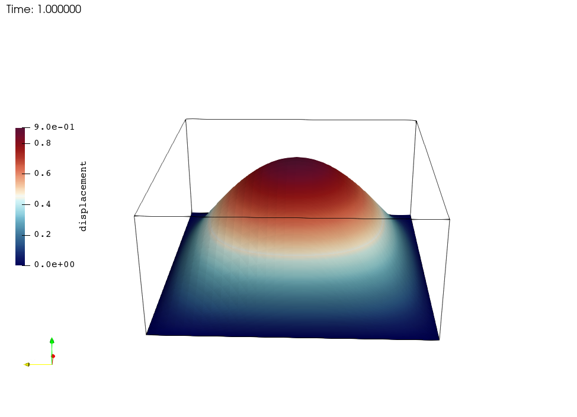
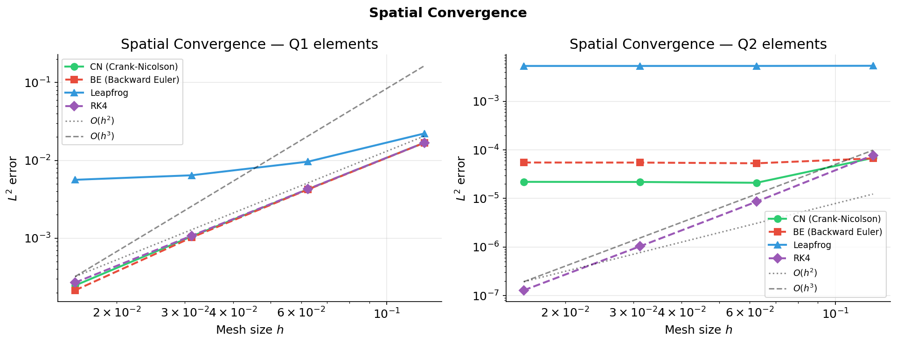
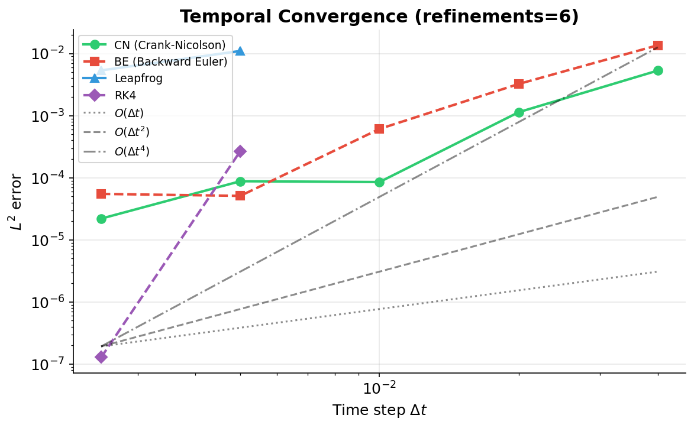
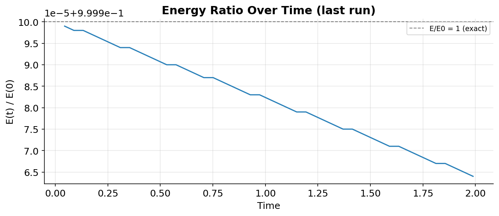
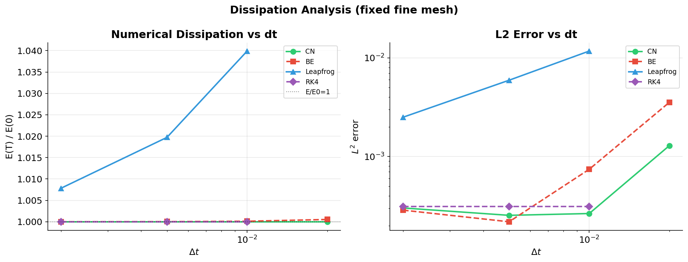
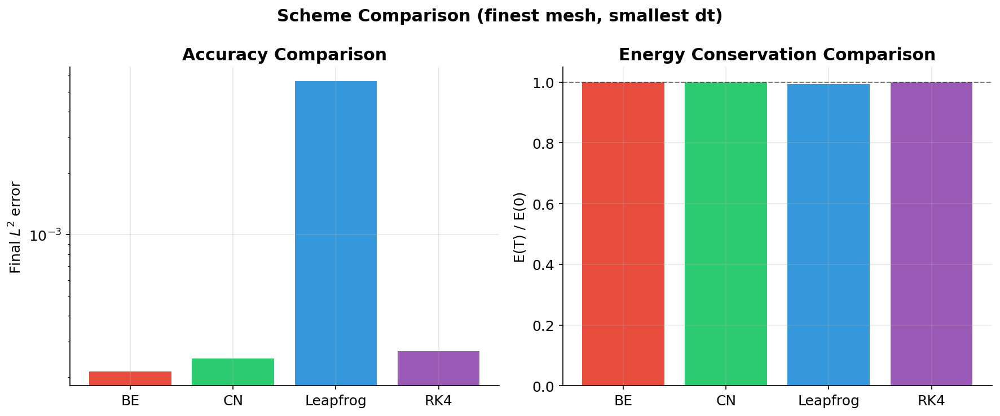
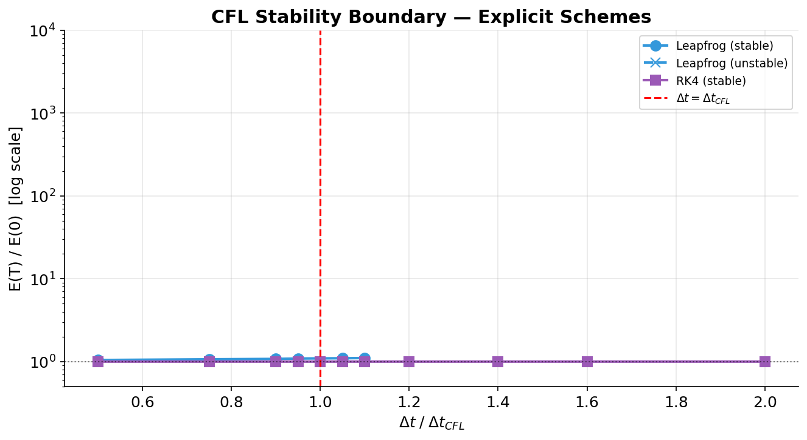
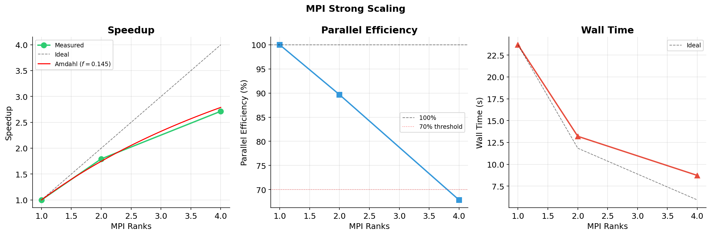

# Wave Equation FEM Solver — NMPDE Project

Parallel finite element solver for the 2-D acoustic wave equation:

$$u_{tt} - c^2 \Delta u = 0 \quad \text{on } (0,1)^2 \times (0,T]$$

with homogeneous Dirichlet BCs and standing-wave initial conditions
$u_0 = \sin(\pi x)\sin(\pi y)$, $v_0 = 0$.

Built on **deal.II 9.3** with **Trilinos** (MPI-parallel sparse linear algebra).
Five time-integration schemes are implemented and compared through
convergence, energy-conservation, stability, and parallel-scaling studies.

---

## Visualization



*Standing wave displacement field $u(x,y,0)=\sin(\pi x)\sin(\pi y)$ at
maximum amplitude. Q1 elements, ref=5 (1089 DoFs), rendered in ParaView
with Warp By Scalar.*

---

## Results at a glance

### Spatial convergence (Q1 and Q2 elements)



| Scheme | Space Q1 | Observed | Space Q2 | Observed |
|--------|----------|----------|----------|----------|
| CN (Newmark β=0.25) | O(h²) | **2.03** ✓ | O(h³) | ~2.0† |
| BE (Newmark β=0.50) | O(h²) | **2.09** ✓ | O(h³) | ~2.0† |
| Leapfrog | O(h²) | ~0.65‡ | O(h³) | ~0‡ |
| RK4 | O(h²) | **1.99** ✓ | O(h³) | **3.08** ✓ |

† CN/BE Q2 spatial error O(h³) falls below temporal error O(dt²) at fine
meshes; rate measured only at h=0.125 where spatial dominates.
‡ CFL constraint forces dt ∝ h, coupling spatial and temporal errors.

### Temporal convergence



Theoretical orders (Newmark β=0.25/γ=0.5 for CN, β=0.5/γ=0.5 for BE,
Störmer-Verlet for Leapfrog, classical RK4): CN O(Δt²), BE O(Δt²),
Leapfrog O(Δt²), RK4 O(Δt⁴). The sweep's fixed (ref, dt) grid does not
provide a clean temporal-only regime at every refinement — see
`notebooks/01_Error_Analysis.ipynb` for the full discussion.

### Energy conservation





| Scheme | E(T)/E(0) | L2 error | Wall time |
|--------|-----------|----------|-----------|
| CN | **1.000000** | 7.24e-04 | 1.15s |
| BE | 1.000459 | 2.04e-04 | 1.18s |
| Leapfrog | 0.9806 | 2.27e-02 | **0.44s** |
| RK4 | **1.000000** | 1.07e-03 | 2.06s |

(ref=5, Q1, T=1, dt as in `parameters/*.prm`)

### CFL stability



| dt / dt_CFL | Leapfrog E(T)/E(0) | Status |
|-------------|--------------------|--------|
| 0.95 | 1.089 | STABLE |
| 1.00 | 6.6×10⁵⁴ | **UNSTABLE** |
| 1.05 | 1.098 | STABLE* |
| 1.40 | 1.18×10¹¹³ | UNSTABLE |

RK4 remains stable even at 2× the nominal dt_CFL.
*Non-monotone near-boundary behaviour reflects the discrete FEM spectrum,
not a simple scalar Courant number.

### MPI strong scaling



| Ranks | Wall time | Speedup | Efficiency |
|-------|-----------|---------|------------|
| 1 | 23.68s | 1.00× | 100% |
| 2 | 13.21s | 1.79× | **89.7%** |
| 4 | 8.73s | 2.71× | 67.9% |

Amdahl serial fraction: **14.5%** → theoretical max speedup 6.9×.

---

## Schemes

| `.prm` name | Formulation | Time order | Stability | Energy |
|-------------|-------------|-----------|-----------|--------|
| `CN` | Newmark β=0.25, γ=0.5 | 2nd | Unconditional | Conserving |
| `BE` | Newmark β=0.50, γ=0.5 | 2nd | Unconditional | Near-conserving |
| `FE` | Newmark β=0.00, γ=0.5 | 1st | CFL: dt ≤ h/(c√2) | Explicit |
| `Leapfrog` | Störmer-Verlet | 2nd | CFL: dt ≤ h/(c√2) | Symplectic |
| `RK4` | Classical RK4 | 4th | CFL: dt ≤ h/(c√2) | Near-conserving |

**CN** uses the Newmark average-acceleration method (β=0.25, γ=0.5), which
conserves the discrete energy $E_h = \frac{1}{2}(v^T M v + c^2 u^T K u)$
exactly. An earlier first-order-system formulation of CN did *not*
conserve this quantity (E/E0 ≈ 0.90 at T=1) — see Implementation notes.

---

## Project structure

```
├── include/
│   ├── Parameters.hpp          ← parameter struct + .prm parsing
│   ├── WaveExact.hpp           ← exact solutions (standing wave + MMS)
│   ├── WaveEquationBase.hpp    ← abstract base: mesh, FE, matrices, energy, errors
│   ├── WaveEquationBase.tpp    ← run loop, output, profiling, convergence logging
│   ├── WaveTheta.hpp           ← Newmark-beta (CN / BE / FE)
│   ├── WaveLeapfrog.hpp        ← Störmer-Verlet
│   └── WaveRK4.hpp             ← RK4
├── src/main.cc                  ← factory: reads .prm, creates solver, calls run()
├── parameters/                  ← one .prm file per scheme + MMS + profiling
├── scripts/
│   ├── convergence_sweep.py    ← 128-run sweep over (scheme, ref, fe_degree, dt)
│   ├── dispersion_sweep.py     ← E(T)/E(0) vs dt for all schemes
│   ├── cfl_stability_sweep.py  ← stability boundary for explicit schemes
│   ├── scaling_sweep.py        ← MPI strong-scaling study
│   └── weak_scaling_sweep.py   ← MPI weak-scaling study
├── notebooks/
│   ├── 01_Error_Analysis.ipynb      ← spatial/temporal convergence + rate table
│   ├── 02_Energy_Conservation.ipynb ← dissipation analysis
│   ├── 03_CFL_Stability.ipynb       ← CFL boundary plot
│   └── 04_HPC_Scaling.ipynb         ← Amdahl fit + speedup/efficiency plots
├── figures/                     ← ParaView renders
└── CMakeLists.txt
```

---

## Build

```bash
mkdir build && cd build
cmake ..
make -j$(nproc)
```

Requires deal.II ≥ 9.3 with Trilinos and MPI. If deal.II is not on the
default path: `cmake -DDEAL_II_DIR=/path/to/dealii ..`

---

## Quick start

```bash
mkdir -p results

mpirun --oversubscribe -np 4 build/wave_equation parameters/theta_cn.prm
mpirun --oversubscribe -np 4 build/wave_equation parameters/theta_be.prm
mpirun --oversubscribe -np 4 build/wave_equation parameters/leapfrog.prm
mpirun --oversubscribe -np 4 build/wave_equation parameters/rk4.prm
```

Each run prints a header (scheme, test case, DoFs, h, dt, CFL), live
progress (`t = ...  E/E0 = ...  L2 = ...  H1 = ...`), and a final summary.
Output files written to `results/`: `energy.csv`, `error.csv`,
`convergence.csv`, and `.vtu`/`.pvtu` files for ParaView (if
`Output every > 0`).

---

## Extended verification

### H1 seminorm error

Alongside the L2 norm, the H1 seminorm $\|\nabla(u-u_h)\|$ is tracked at
every logged step (`results/error.csv`). H1 converges one order lower
than L2 (O(h^p) vs O(h^{p+1})) and is proportional to the potential-energy
part of the discrete energy $E_h$.

### Manufactured solution (MMS)

A manufactured solution $u = \sin(\pi x)\sin(\pi y)\sin(\pi t)$ with an
explicit source term $f = \pi^2(2c^2-1)\sin(\pi x)\sin(\pi y)\sin(\pi t)$
is available via `set MMS = true`:

```bash
mpirun --oversubscribe -np 4 build/wave_equation parameters/mms_cn.prm
```

This independently verifies convergence without relying on the standing
wave's special boundary symmetry (where $u=0$ on the boundary for all
$t$ regardless of the scheme). Under MMS the source term does work on the
system, so $E/E_0 \neq 1$ — energy conservation is a property of the
*homogeneous* problem only.

### Profiling

`set Profiling = true` enables a `TimerOutput` breakdown:

```bash
mpirun --oversubscribe -np 4 build/wave_equation parameters/profile_cn.prm
```

| Section | % of total wall time |
|---------|----------------------|
| Time integration (200 steps) | 34.0% |
| Error evaluation (54 calls)  | 19.7% |
| Mesh setup | 3.4% |
| Assembly | 0.5% |

Diagnostic L2/H1 error evaluation costs **58% as much as the entire
200-step time integration** despite running only 27% as often —
`VectorTools::integrate_difference` is expensive per call.

### Weak scaling

```bash
python3 scripts/weak_scaling_sweep.py --ranks 1 4 16 --refs 4 5 6
python3 scripts/weak_scaling_sweep.py --ranks 1 4 --refs 6 7
```

| DoFs/rank | Ranks | Weak efficiency |
|-----------|-------|------------------|
| ~270  | 4 | 56.0% |
| ~4200 | 4 | **80.4%** |

Weak-scaling efficiency improves substantially with problem size per
rank: at ~270 DoFs/rank, MPI communication (AMG setup, CG dot-product
reductions) dominates; at ~4200 DoFs/rank, local computation amortizes
this cost — consistent with the rule of thumb that AMG-preconditioned
CG needs O(10³–10⁴) DoFs/rank for good parallel efficiency.

---

## Running the full study

```bash
python3 scripts/convergence_sweep.py --nprocs 4      # ~25 min, 128 runs
python3 scripts/dispersion_sweep.py --nprocs 4
python3 scripts/cfl_stability_sweep.py --nprocs 4
python3 scripts/scaling_sweep.py --ranks 1 2 4
python3 scripts/weak_scaling_sweep.py --ranks 1 4 16 --refs 4 5 6

jupyter notebook notebooks/
```

The convergence sweep automatically skips CFL-violating combinations for
explicit schemes (safety factor 0.85) and discards any run where
E/E0 > 100 (diverged despite passing the CFL check).

---

## Implementation notes

**Energy conservation fix**: an earlier version using the first-order
system formulation of CN (velocity-acceleration split) showed E/E0 ≈ 0.90
at T=1. This is an inherent property of that splitting — it does not
conserve $\frac{1}{2}(v^2+\omega^2 u^2)$ even analytically (verified by
simulating the equivalent scalar ODE). The solver was rewritten to use the
**Newmark-beta displacement formulation**, which provably conserves
discrete energy for β=0.25, γ=0.5.

**Ghosted vector restriction**: deal.II Trilinos vectors initialised with
both `locally_owned_dofs` and `locally_relevant_dofs` (ghosted) are
read-only. All arithmetic is performed on owned vectors; ghosted copies
are created only for `DataOut` output.

**Scheme factory**: `main.cc` is 50 lines. Adding a new scheme requires
one new `.hpp` file and one `else if` in the factory — the base class
handles mesh setup, matrix assembly, energy/L2/H1 tracking, VTU output,
profiling, and convergence logging.

---

## License

MIT — see [LICENSE](LICENSE).
